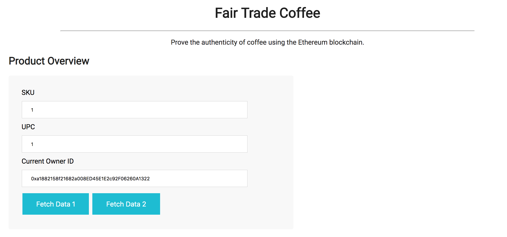
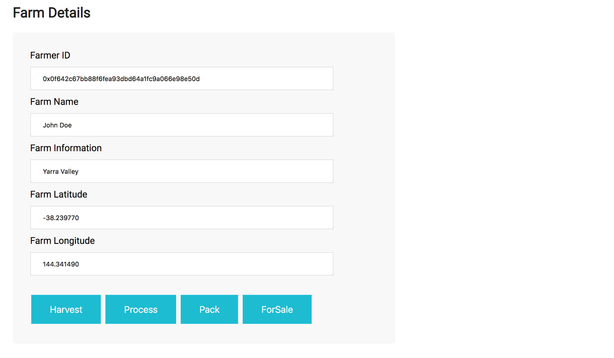
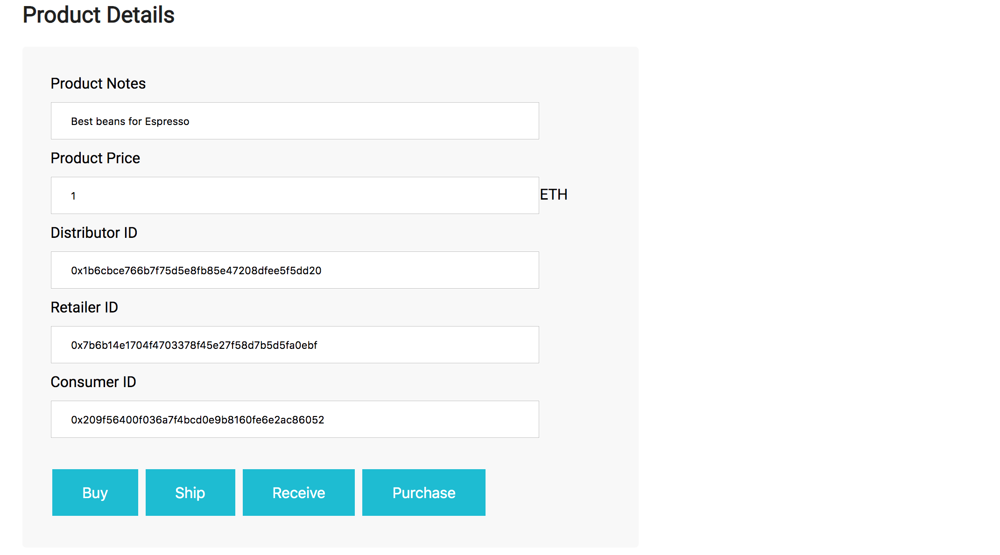
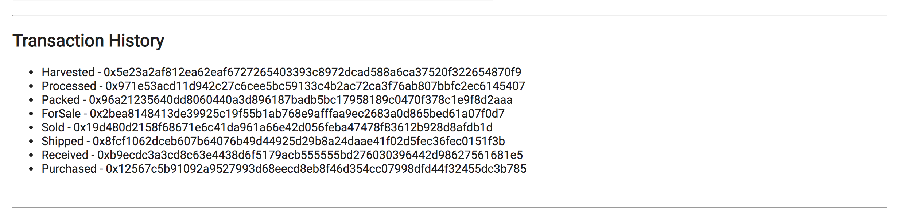
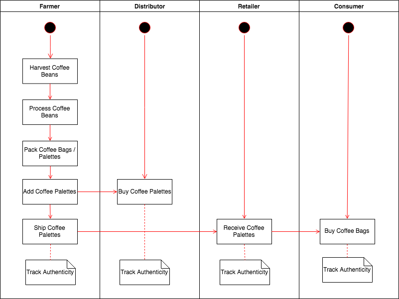
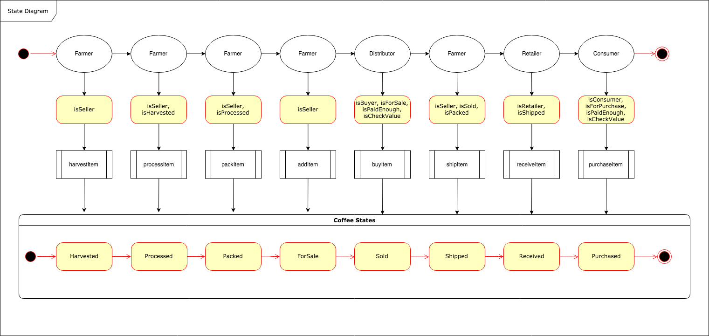
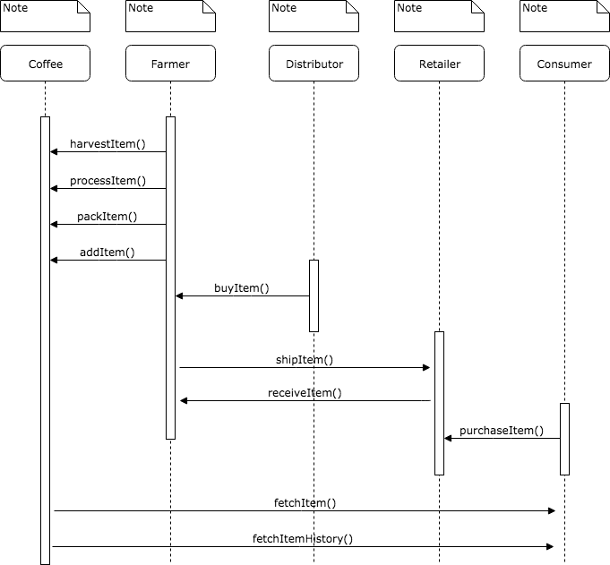
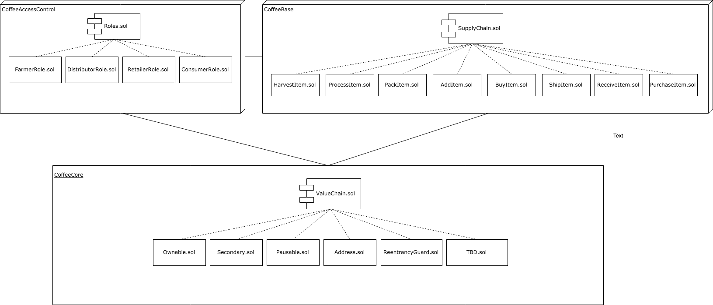

#Supply chain & data auditing

This repository containts an Ethereum DApp that demonstrates a Supply Chain flow between a Seller and Buyer. The user story is similar to any commonly used supply chain process. A Seller can add items to the inventory system stored in the blockchain. A Buyer can purchase such items from the inventory system. Additionally a Seller can mark an item as Shipped, and similarly a Buyer can mark an item as Received.

###Screenshot of DAPP UI









### Transaction ID and Contract ID from a blockchain explorer , details included in rinkby.txt

https://rinkeby.etherscan.io/tx/0x57735b53cac8880ce4ebe02818791a251c3e0cf9492e02d86b4525bac695ba23

### Diagrams
* Activity

* 
*State

* 
* Sequence

* 
* Class



### Versions Used
* Solidity v0.4.24
  Solidity is an object-oriented, high-level language for implementing smart contracts. Contrcats included in this project support solidity compiler versions >= 0.4.21 to < 0.6.0.
* Ganache v1.2.3
    Ganache is a personal blockchain for Ethereum development you can use to deploy contracts, develop your applications, and run tests. It is available as both a desktop application as well as a command-line tool. Desktop application was used during development of this project.
* Truffle v5.0.2 
   Truffle is a world class development environment, testing framework and asset pipeline for blockchains using the Ethereum Virtual Machine (EVM). aiming to make life as a developer easier. All contracts included in this project have been developed and tested in Truffle frame work.
* Web3 v0.14.0 
    Web3 is a collection of libraries which allow you to interact with a local or remote Ethereum node, using an HTTP, WebSocket or IPC connection.
* truffle-assertions v0.8.2
    This package adds additional assertions that can be used to test Ethereum smart contracts inside Truffle tests. Project uses this library to explicityly test appropriate Events are emitted during state change.

### IPFS
InterPlanetary File System (IPFS) is a protocol and network designed to create a content-addressable, peer-to-peer method of storing and sharing hypermedia in a distributed file system. 
Current projet has not been uploaded to IPFS.

## Getting Started

These instructions will get you a copy of the project up and running on your local machine for development and testing purposes. See deployment for notes on how to deploy the project on a live system.

### Prerequisites

Please make sure you've al
ready installed ganache-cli, Truffle and enabled MetaMask extension in your browser.

### Installing

A step by step series of examples that tell you have to get a development env running

Clone this repository:

```
git clone https://github.com/udacity/nd1309/tree/master/course-5/project-6
```

Change directory to ```project-6``` folder and install all requisite npm packages (as listed in ```package.json```):

```
cd project-6
npm install
```

Launch Ganache:

```
ganache-cli -m "spirit supply whale amount human item harsh scare congress discover talent hamster"
```

Your terminal should look something like this:


In a separate terminal window, Compile smart contracts:

```
truffle compile
```

Your terminal should look something like this:


This will create the smart contract artifacts in folder ```build\contracts```.

Migrate smart contracts to the locally running blockchain, ganache-cli:

```
truffle migrate
```

Your terminal should look something like this:


Test smart contracts:

```
truffle test
```

All 10 tests should pass.


In a separate terminal window, launch the DApp:

```
npm run dev
```

## Built With

* [Ethereum](https://www.ethereum.org/) - Ethereum is a decentralized platform that runs smart contracts
* [IPFS](https://ipfs.io/) - IPFS is the Distributed Web | A peer-to-peer hypermedia protocol
to make the web faster, safer, and more open.
* [Truffle Framework](http://truffleframework.com/) - Truffle is the most popular development framework for Ethereum with a mission to make your life a whole lot easier.


## Authors

See also the list of [contributors](https://github.com/your/project/contributors.md) who participated in this project.

## Acknowledgments

* Solidity
* Ganache-cli
* Truffle
* IPFS
